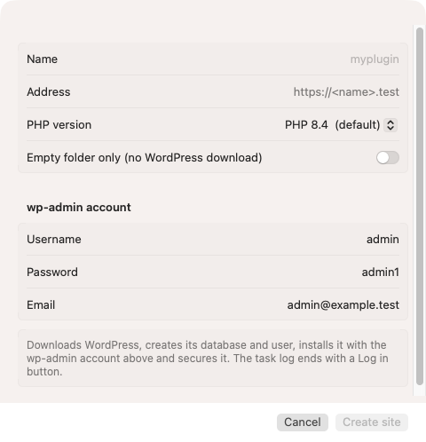
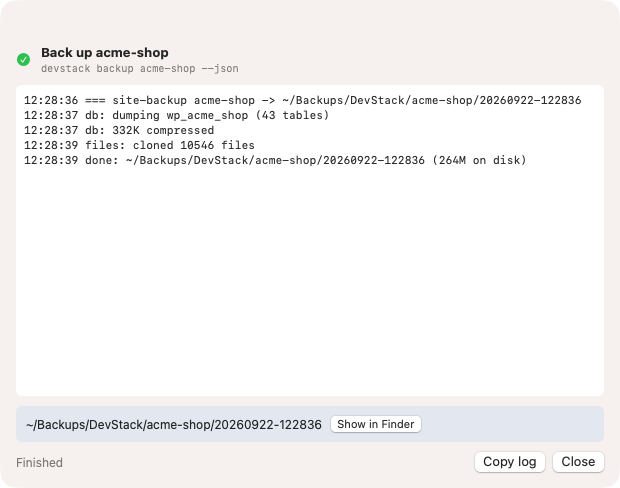
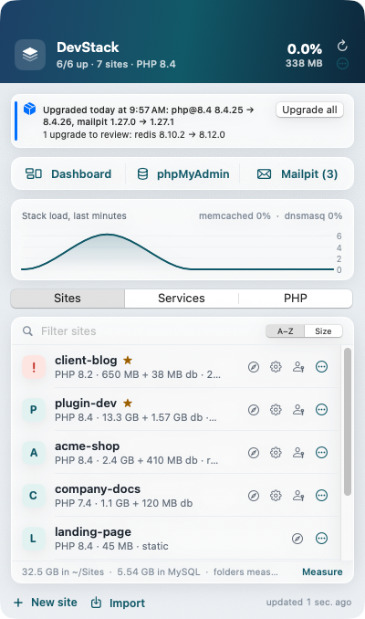
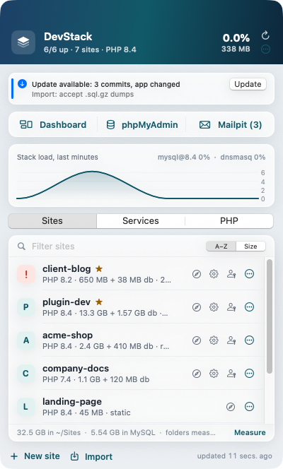

# DevStack

Native local WordPress development for macOS on Apple Silicon. No Docker, no VM, no licence.

Laravel Valet (nginx, dnsmasq, `https://<site>.test`) · Homebrew PHP 7.4 and 8.0–8.6, one version per site ·
MySQL 8.4 · Mailpit · Redis · Memcached · WP-CLI · phpMyAdmin · one global `devstack` command · a menu-bar app.


## What you get

| | |
|---|---|
| Sites | `~/Sites/<name>` served at `https://<name>.test` with a certificate your browsers trust |
| PHP | 7.4, 8.0, 8.1, 8.2, 8.3, 8.4 (default), 8.5, 8.6, each with redis, imagick, memcached and Xdebug (off, trigger mode); per-site version |
| Database | MySQL 8.4 on `127.0.0.1:3306`, root without a password (local only); one `wp_<name>` database and one user per site; phpMyAdmin at `https://phpmyadmin.test`, signed in |
| Mail | Every site's outgoing mail lands in Mailpit at `http://localhost:8025` (SMTP 1025); nothing leaves the machine |
| Caching | Redis on 6379 and Memcached on 11211 running, PHP extensions loaded; opt in per site with a drop-in plugin |
| Tools | `devstack` command with zsh completion, dashboard at `https://dashboard.test`, DevStack.app in the menu bar |
| Logs | nginx, PHP, MySQL, Redis, Mailpit and each site's `debug.log`, rotated daily, nothing older than 48 hours |

## Requirements

- An Apple Silicon Mac on macOS 14 or newer. Paths assume `/opt/homebrew`; Intel Macs are not supported.
- [Homebrew](https://brew.sh).
- Xcode Command Line Tools (`xcode-select --install`) or Xcode. Either one builds the app.
- An administrator account. `bootstrap.sh` asks for your password twice: once so Valet can install its `.test` DNS
  resolver, once for `valet trust`, which lets `brew services` and `valet` run without a password afterwards.
- Ports 80, 443, 3306, 1025, 8025, 6379 and 11211 free. Quit MAMP, stop LocalWP's router (or switch it to
  "localhost" mode in LocalWP's preferences), and stop any other Homebrew nginx or MySQL before you start.

## Install

```bash
git clone git@github.com:saad-siddique/DevStack.git ~/Work/DevStack
cd ~/Work/DevStack
./bootstrap.sh --app
```

`bootstrap.sh` is idempotent. Run it again after every `git pull`; it only changes what differs. A fresh Mac takes
10–20 minutes, mostly downloading PHP versions. In order, it:

1. Taps `shivammathur/php` and `shivammathur/extensions`, then runs `brew bundle` on the `Brewfile`: PHP 7.4–8.6,
   mysql@8.4, mailpit, redis, memcached, composer, wp-cli, and redis/imagick/memcached/xdebug for every PHP version.
2. Links `php@8.4` as the command-line `php`, copies `php/zz-uo-dev.ini` into every `/opt/homebrew/etc/php/<v>/conf.d/`
   (512 MB memory, 1 GB uploads, `display_errors` on, `sendmail_path` → Mailpit, Xdebug trigger mode on port 9003)
   and switches Xdebug off by default.
3. Installs Laravel Valet through Composer, runs `valet install` (nginx, dnsmasq, `/etc/resolver/test`) and
   `valet trust`. Patches Valet's nginx stubs to listen on `[::1]` too and to accept `php@8.6`.
4. Starts mysql@8.4, mailpit, redis and memcached as `brew services`, so they come back after a reboot.
5. Links and secures `dashboard.test`; downloads phpMyAdmin into `~/.local/share/devstack/phpmyadmin` and serves it
   as `phpmyadmin.test`.
6. Installs a user LaunchAgent, `com.devstack.logs-prune`, that rotates logs daily at 04:00.
7. Links `bin/devstack` to `/opt/homebrew/bin/devstack` and its completion into `share/zsh/site-functions`.
8. With `--app`: builds `DevStack.app`, installs it into `/Applications` and starts it.

When it finishes, **DevStack.app is in `/Applications` and already running**: look for the stacked-layers DevStack
icon in the menu bar, top right, next to the clock. Everything below can be done from that icon. Open a new terminal only if
you also want the `devstack` command on your PATH.

## Using the app

**Where it is.** `/Applications/DevStack.app`. It has no Dock icon and no main window; it lives in the menu bar as
the stacked-layers icon (the same glyph as the app icon and the dashboard's tab icon) and opens a panel when clicked. Turn on *Start at login* in the panel's ⋯ menu and it will always
be there. If the icon is missing, `devstack app open` starts it; `devstack app install` rebuilds it after an update.
The icon gains an exclamation badge when a core service is down or launchd reports an error.

**The panel**, top to bottom:

- Header: how many services are online, how many sites, the default PHP version; a refresh button and the ⋯ menu
  (dashboard, repo and Sites folders, Start at login, update checks, the nightly-upgrade switch, Quit).
- Notices, when there are any: **Update available** for this repo; the **stack upgrades** line (see *Keeping
  the stack current* below); a **runaway** line when a stack process has sat above 120% CPU for 90 seconds or holds
  more than 3 GB, with a Restart button; and a **reports** line when macOS wrote a crash or resource report for a
  stack process in the last 24 hours (Open shows it in Console).
- macOS notifications (allow them once when asked; mute with *Notifications* in the ⋯ menu): every service start,
  stop or restart, Xdebug and PHP switches, every finished or failed task (backup, import, restore, clone, remove,
  update, upgrade), a core service going down, a watchdog restart, a new crash or resource report, an overnight
  upgrade, an update becoming available.
- **⌃⌥D** opens the panel from anywhere. *Previous tasks* in the task window shows the last 20 logs.
- *Show load graph in the menu bar* (⋯ menu) draws a small CPU sparkline next to the icon, sampled every 15 s.
- Quick-open: **Dashboard** (`https://dashboard.test`), **phpMyAdmin** (every database, signed in as root) and
  **Mailpit** with the count of caught mails.
- **Stack load**: CPU and memory of the stack's own processes (php-fpm, nginx, mysqld, redis, memcached, mailpit,
  dnsmasq) over the last three minutes. Sampled only while the panel is open.
- **Sites**: every linked site with its PHP version and type. Lock = HTTPS, shield = protected. Per row: open the
  site, log in to wp-admin (key icon), and a ⋯ menu with Open wp-admin, Open folder, Copy URL, Back up now, Remove….
- **Services**: nginx, dnsmasq, MySQL, Mailpit, Redis, Memcached with an on/off switch and a restart button, plus who
  owns each port.
- **PHP**: every installed version with its php-fpm switch (the default version always runs) and an **Xdebug**
  checkbox (trigger mode, port 9003; ticking it restarts that php-fpm).
- Footer: **New site…** and **Import…**.

**Doing things:**

| Task | In the app |
|---|---|
| Create a site | New site… → name, PHP version, wp-admin username/password/email (`admin` / `admin1` prefilled) → Create site. WordPress is downloaded and installed; the task log ends with the URL, the credentials and a **Log in to wp-admin** button. |
| Import a site | Import… → name, Choose… the LocalWP export `.zip`, a WordPress folder, or a DevStack backup folder; optionally a separate `.sql`; PHP version → Import site. |
| Open a site | Compass icon on its row, or its URL `https://<name>.test`. |
| Log in to wp-admin | Key icon on its row. A one-time link signs you in as the first administrator; nothing to type. |
| Back up a site | ⋯ → Back up now. Files are cloned and the database dumped into `~/Backups/DevStack/<site>/<stamp>/`. |
| Archive a site | ⋯ → Archive (back up, then remove)…. A verbatim backup is taken and kept, then the site is removed. Tick *Compress the files* when you want the disk space back (see Backups below). Protected sites cannot be archived. |
| Share a site publicly | ⋯ → Share publicly. A Cloudflare tunnel opens: the hostname from your `~/.cloudflared/config.yml` when a rule points at the site, otherwise a random `trycloudflare.com` URL. The URL is copied and opened; a line in the panel shows it with Stop. The site answers under that hostname (a mu-plugin adjusts home/siteurl for tunnel requests), so webhooks and remote testers work. |
| Save and roll back a database | ⋯ → Save point (database), seconds. In Backups… a save point has **Roll back database**: drop, recreate, import, files untouched. |
| Object cache | ⋯ → Object cache → Redis / Memcached / Off. Installs the plugin and drop-in with a per-site key prefix, so sites sharing one Redis never collide; the row shows "redis cache". |
| Pin the sites you use daily | ⋯ → Add to favourites. Favourites show a ★ and always sort first, whatever the sort; the dashboard has the same star in the Site column. |
| See what a site costs | Each row shows folder + database size; the Size sort puts the biggest first; the line under the list has the totals and a *Measure* button (folders are walked nightly, databases are live). |
| Restore a site | ⋯ → Restore from backup…, or ⋯ menu → Backups…. Restore recreates it exactly: same address, PHP version, database name and logins. If the site still exists you are asked to replace it (a safety backup is taken first). |
| Duplicate a site | ⋯ → Duplicate…. Backs up, then imports the backup under the new name with its own database and rewritten URLs. |
| Manage backups | ⋯ menu → Backups…: every backup with date, size and PHP version; Restore, Show in Finder, Delete; *Keep newest 5 per site* prunes the rest. |
| Spot a broken site | A red badge and "N fatals in debug.log" on the row when WordPress logged PHP fatals today or yesterday; ⋯ → Open debug.log. |
| Start/stop a service | Services tab → switch. Restart with the arrow. |
| Switch Xdebug on or off | PHP tab → Xdebug checkbox on that version. |
| Stop an idle PHP version | PHP tab → switch (the default version stays on). |
| Change a site's PHP version | ⋯ → PHP version → pick one. Writes `.valetrc`, isolates the site, starts that php-fpm. |
| Open a site in your editor or terminal | ⋯ → Open in VS Code / Cursor / PhpStorm / Terminal (whatever is installed). |
| Check the whole stack | ⋯ → Run doctor. Every check with its fix, in the task window. |
| See what went wrong | Every long task streams its log into the task window; *Copy log* copies it. Stack logs are on the dashboard's Logs tab. |

 

**Look.** Light mode is "Glass": translucent cards on a cool gradient, a teal hero carrying the stack glyph and the
live CPU figure, letter tiles per site, rounded numerals. Dark mode is "Console": graphite cards, glowing green LEDs,
a light-teal accent. Both follow the system appearance; the dashboard uses the same palettes. The three directions
that were considered are kept at `https://dashboard.test/design/`.

**How it works.** The app never talks to brew, Valet or MySQL itself. Every button runs the same `devstack …`
command you could type, and reads its `--json` output, so the two never disagree. It reads status once a minute
while the panel is open and once every five minutes while closed. Long tasks run in one ordinary window that
survives the panel closing.

**Building.** `devstack app install` builds the app with Swift Package Manager (Xcode or the Command Line Tools),
signs it ad hoc (locally built apps carry no quarantine flag) and copies it to `/Applications`. With a Developer ID:
`devstack app install --sign "Developer ID Application: …"` or `DEVSTACK_SIGN_IDENTITY`. `devstack app snapshot`
renders every window to `docs/img/*.png` with made-up site names.

## Where things live

| | |
|---|---|
| The app | `/Applications/DevStack.app`, built from `app/` |
| Site files | `~/Sites/<name>` (`SITES_DIR=…` in your shell to use another folder) |
| Settings and state | `~/.local/share/devstack/` (`settings.json` for the nightly-upgrade choice, `upgrades.json` for the last check) |
| Valet state | `~/.config/valet`: `Sites/` links, `Nginx/` per-site confs, `Certificates/`, `Log/` |
| Databases | `/opt/homebrew/var/mysql`; per site one `wp_<name>` schema and a `wp_<name>` user, `DB_HOST 127.0.0.1` |
| PHP settings | `/opt/homebrew/etc/php/<v>/php.ini` is never edited; overrides live in `conf.d/zz-uo-dev.ini` |
| Per-site PHP version | `.valetrc` in the site folder (`php=php@7.4`), applied with `valet isolate` |
| Backups | `~/Backups/DevStack/<site>/<stamp>/` (`BACKUP_ROOT=…` to move them) |
| Logs | `~/.config/valet/Log/` (nginx, PHP), `/opt/homebrew/var/log/` (php-fpm, redis, mailpit, rotation), `/opt/homebrew/var/mysql/*.err`, `<site>/wp-content/debug.log`; each `devstack` command appends to `~/Library/Logs/DevStack/<command>-<site>.log` |
| phpMyAdmin | `~/.local/share/devstack/phpmyadmin` |
| This repo | wherever you cloned it; `devstack path` prints it |

## The terminal alternative: `devstack`

Everything the app does is a `devstack` verb, and a few things only exist there (migration from MAMP, log tails,
`--json` output for scripts). It is on your PATH from any directory, with zsh completion. Verbs map to the scripts in
`bin/`; any script name also works (`devstack site-new …`).

```bash
devstack new myplugin --php 8.2                  # fresh WordPress at https://myplugin.test; wp-admin admin / admin1 unless
                                                 # --admin-user/--admin-password/--admin-email say otherwise
                                                 # --php accepts 7.4, 8.0, 8.1, 8.2, 8.3, 8.4 (default), 8.5, 8.6
devstack login myplugin                          # opens wp-admin already signed in (one-time link, 60 s, first admin)
devstack import client ~/Downloads/client.zip    # LocalWP export, any zip/folder with a WordPress root + .sql, or a backup folder
devstack backup myplugin                         # ~/Backups/DevStack/myplugin/<stamp>/ — see Backups
devstack backups                                 # list them, newest first
devstack backups --prune --keep 5                # delete older backups (the newest of every site always stays)
devstack archive myplugin [--compress]           # verbatim backup, then remove the site; --compress really frees the disk
devstack sizes [--refresh]                       # disk per site folder (the nightly run refreshes; --refresh walks now)
devstack favorite myplugin [on|off]              # pin a site to the top of the Sites list, in the app and on the dashboard
devstack share myplugin | --stop                 # public URL through Cloudflare: your named tunnel if ~/.cloudflared maps one, else a quick one
devstack cache myplugin redis|memcached|off      # persistent object cache for one site (per-site key prefix, shared servers)
devstack backup myplugin --db-only --label "x"   # database save point; devstack restore myplugin --db-only rolls back to the newest
devstack doctor --fix                            # start what is stopped, re-run bootstrap for gaps, check again
devstack uninstall --yes [--purge]               # remove DevStack (sites, databases, backups stay)
devstack restore myplugin [--replace]            # bring it back exactly as it was (same URL, PHP, database, logins)
devstack clone myplugin myplugin-copy            # a copy under a new name: own database, URLs rewritten
devstack remove myplugin --yes --backup          # same as archive, spelled out
devstack sites                                   # linked sites with PHP version and protection flag
devstack php myplugin 7.4                        # switch one site's PHP version (7.4 … 8.6, or default); starts that php-fpm
devstack doctor                                  # check everything (DNS, nginx, php-fpm, MySQL, ports, certs, agents) with fixes
devstack open myplugin | dashboard | phpmyadmin | mailpit
devstack xdebug on --php 8.4                     # trigger mode, port 9003; XDEBUG_TRIGGER=1 or a browser helper starts a session
devstack service mailpit restart                 # nginx dnsmasq mysql@8.4 mailpit redis memcached php@<any installed>
devstack status | jq .                           # what the dashboard and the app read
devstack logs list                               # every stack log with size: nginx php php-fpm mysql redis mailpit, wp <site>
devstack logs php -n 100                         # tail one; `devstack logs crashes` lists macOS crash reports for stack processes
devstack logs-prune                              # rotate now (the LaunchAgent does this daily at 04:00)
devstack update                                  # git pull + bootstrap
devstack app install | open | snapshot | status  # the menu-bar app
devstack help                                    # all of the above
```

## Bringing your existing sites

**From LocalWP.** In LocalWP, right-click the site and choose *Export* (keep everything selected). In DevStack:
**Import…**, pick the `.zip`, choose the PHP version, Import site. Or:

```bash
devstack import client ~/Downloads/client.zip --php 8.2
```

Import unpacks the zip, finds the WordPress root and the largest `.sql`, copies the files to `~/Sites/client`,
creates `wp_client` and its user, imports the dump, points wp-config at the new database, drops hard-coded
`WP_HOME`/`WP_SITEURL` constants, rewrites every old URL (`client.local`, http and https, serialized data included)
to `https://client.test`, links and secures the site and smoke-tests it. Users and passwords in the database are
untouched, so your LocalWP credentials still work, and so does `devstack login client`.

**From any host, or a folder plus a dump.** Import… → Choose… the folder, then Choose… the dump; or
`devstack import name /path/to/wordpress --sql dump.sql` (`.sql.gz` works).

**From another DevStack machine.** Back up the site there (⋯ → Back up now), copy the stamped folder over, Import…
it here. The manifest carries the PHP version.

**From MAMP or MAMP PRO on the same machine.** Fill `sites.tsv` (host, folder, PHP, MAMP database, protected flag)
and run `devstack migrate <host>` per site or `devstack migrate-all`. Each site's database is copied out of MAMP's
MySQL on port 8889 into MySQL 8.4 and its URLs rewritten; MAMP's copy is never touched, so the rollback is "start
MAMP". `devstack mamp-backout` removes MAMP's hosts entries, helper daemon and shell hooks once you are done. The
`sites.tsv` in this repo is the author's inventory; replace it with yours. The full runbook is
`docs/mamp-to-valet-migration-handoff-v2.md`.

**Not WordPress.** `devstack new tool --empty` links an empty folder with a placeholder `index.php`. For anything
already on disk: `cd ~/Sites/<folder> && valet link && valet secure`. Valet serves Laravel, plain PHP and static
sites with its built-in drivers.

## PHP versions, WP-CLI and Xdebug

- Sites without a `.valetrc` run the default, PHP 8.4. `--php` on `new`/`import` isolates a site; for an existing one:
  `printf 'php=php@7.4\n' > ~/Sites/site/.valetrc && valet isolate php@7.4 --site=site`.
- php-fpm runs only for the default version and for versions some site isolates. Stop an idle one with
  `devstack service php@8.2 stop` or the switch on the app's PHP tab.
- `wp` on your PATH is WP-CLI under PHP 8.4. Inside an isolated site use Valet's proxy so it matches the site's
  version: `valet php /opt/homebrew/bin/wp plugin list`. (`valet composer` does the same for Composer.)
- Xdebug is installed for every version and off by default because it costs speed. The Xdebug checkbox on the app's
  PHP tab, or `devstack xdebug on --php 8.4`, turns it on in trigger mode (port 9003, restarts that php-fpm); start a session with the `XDEBUG_TRIGGER=1` cookie,
  a browser helper extension, or `XDEBUG_TRIGGER=1 wp …`. No path mappings are needed, everything is local.

## Protected sites

Mark a site `protected=yes` in `sites.tsv` and the tooling will not remove it (`devstack remove` and the app refuse),
will not batch-migrate it, and will only migrate it with an explicit backup flag. Backups are still allowed; they are
read-only on the site.

## One-click login

The key icon on a site row, "Log in to wp-admin" after creating a site, or `devstack login <site>`: each mints a 48-hex one-time token, stores
its SHA-256 as a 60-second transient through WP-CLI, and opens `https://<site>.test/?uo_login=<token>`. The
`uo-local-autologin.php` mu-plugin, installed into every site by `new`, `import`, `migrate` and on first `login`,
checks that the host ends in `.test`, deletes the transient, compares hashes with `hash_equals`, sets the auth cookie
and redirects to wp-admin. A reused or expired link gets a 403. `--user <login>` picks another account; the default is
the first administrator (the first super admin on multisite).

## Sharing a site publicly

`devstack share <site>` starts a Cloudflare tunnel detached and prints the URL. If `~/.cloudflared/config.yml` has an
ingress rule whose `service` is `https://<site>.test`, the *named* tunnel runs and the URL is that stable hostname,
which is what you want for webhooks you configure once at Zapier or Stripe. `devstack share <site> --hostname
saad-wp.example.com` rewrites or adds that rule (pointing it at the site with `noTLSVerify` and the right host
header) before starting. Without a mapping you get a quick tunnel: a random `*.trycloudflare.com` URL, no account.
`--stop` ends it; `--status` and `devstack status` show it; the app and the dashboard show the URL with Stop.

WordPress under a foreign hostname would normally redirect to its `.test` address. The `uo-local-share.php`
mu-plugin, present in every site, filters `home`/`siteurl` to the request host when Cloudflare headers are present,
marks the request HTTPS and disables canonical redirects, so pages, assets and REST callbacks all use the public URL.
No per-developer `wp-config.php` block is needed any more.

## Backups, archive, restore, clone

⋯ → Back up now on a site row, or `devstack backup <site>`, writes `~/Backups/DevStack/<site>/<YYYYMMDD-HHMMSS>/` holding `files/` (an APFS clone of the
site folder: instant, and space-free until either side changes), `db.sql.gz` (`mysqldump --force`, so a stale view
cannot abort it) and `manifest.json` (name, PHP version, database, table count). A 260 MB site backs up in under
three seconds.

- **Archive** (`devstack archive <site>`, or ⋯ → Archive in the app) backs up, then removes the site. It refuses to
  remove anything when the backup fails. Archive compresses by default (`files.tar.zst`, minutes for a multi-gigabyte
  folder) because its point is to free the disk: an APFS clone would keep sharing blocks with the deleted site and
  free only the database. `--no-compress` (untick the box) keeps the instant clone. Restore and Import unpack either.
- **Save points** (`devstack backup <site> --db-only --label "before X"`, or ⋯ → Save point) are database-only
  backups, a few hundred KB, seconds. `devstack restore <site> --db-only [--from DIR]` or **Roll back database** in
  Backups… drops and rebuilds the database from one; files stay.
- **Footprint**: `devstack status` carries each site's database size (live, from `information_schema`) and folder
  size (from `devstack sizes --refresh`, which the 03:30 run performs; a `du` over 80 GB takes minutes, so it is
  never done on a status read). The app's Sites tab and the dashboard's Disk column show the same numbers, sort by
  them, and can trigger a fresh measurement.
- **Restore** (`devstack restore <site>`, newest backup by default, `--from DIR` for another) puts the site back
  verbatim: files cloned back, wp-config untouched, so the same database name, user and password, `.valetrc` PHP
  version, same URL, no rewrite. `--replace` first takes a safety backup of the current site and removes it.
  Protected sites are restored only while absent.
- **Clone** (`devstack clone <site> <new>`) backs the source up and imports the backup under the new name: own
  `wp_<new>` database and user, every URL rewritten, same logins.
- **Prune** (`devstack backups --prune --keep 5 [--older-than 30]`) deletes older backups per site; the newest one
  always survives. `devstack backups --delete <dir>` removes one. Nothing prunes automatically.

## Logs and retention

- nginx and PHP errors land in `~/.config/valet/Log/`; the php-fpm master log, Redis and Mailpit in
  `/opt/homebrew/var/log/`; MySQL in `/opt/homebrew/var/mysql/*.err`; each WordPress site in its `wp-content/debug.log`.
- The dashboard (`https://dashboard.test`) has Overview, PHP, Services, Logs and Tools tabs. It reloads once a minute
  while visible, never while hidden, and has a Refresh button. Its Logs tab tails any log with severity colouring and a
  filter, and the masthead turns red when launchd reports a service in error or macOS wrote a crash report for a stack
  process in the last 24 hours: the failures WordPress itself cannot report.
- Retention: the `com.devstack.logs-prune` LaunchAgent runs `bin/logs-prune` daily at 04:00. Each log is copied to
  `.1` and truncated in place, so writers keep appending; `.1` files older than 48 hours are deleted and any live log
  over 100 MB is rotated at once.
- Dashboard writes (start/stop, Xdebug) are POST requests that require the `X-Devstack: 1` header and only call the
  `bin/` commands with allow-listed arguments, so another website open in your browser cannot trigger them.

## Guards

What keeps a bad plugin, a stuck request or a forgotten service from ruining the afternoon:

- **launchd restarts** php-fpm, MySQL, Redis, Memcached and Mailpit if they crash (Homebrew sets `KeepAlive`).
  nginx and dnsmasq have no such flag, so a LaunchAgent, `com.devstack.watchdog`, runs `devstack watchdog` every
  five minutes: when launchd still has one of them loaded but no process is running, it restarts it, logs it
  (`devstack logs watchdog`) and the app notifies. A service you stopped on purpose is unloaded and left alone.
- **php-fpm pool guard** (`php/zz-devstack-fpm.conf`, installed for every version): 20 workers instead of Valet's 5
  (wp-admin fires several requests at once and the pool hit its ceiling on day one), workers recycled every 500
  requests, a request killed after 300 s, and anything slower than 15 s written with a stack trace to
  `~/.config/valet/Log/php-fpm-slow.log` (`devstack logs slow`).
- **MySQL** (`mysql/zz-devstack.cnf`): binary logging off (it had grown to 7 GB in a day and earned mysqld a
  macOS "disk writes" report), `innodb_flush_log_at_trx_commit = 2`, a 512 MB buffer pool, 256 MB packets for big
  imports. Bootstrap installs it and deletes the stale binary logs once MySQL runs without them.
- **Runaway watch** in the app: process CPU and memory are sampled every 3 s while the panel is open and once a
  minute while closed; a service above 120% CPU for 90 s or over 3 GB gets a line with a Restart button and a
  notification.
- **macOS reports**: `devstack logs crashes` lists crash reports (`.ips`) and resource reports (`.diag`: disk
  writes, CPU, wakeups) for stack processes. Crashes are red, resource reports orange, in the app, on the dashboard
  and in `devstack doctor`.
- **`devstack doctor`**: DNS resolver and dnsmasq, nginx and its config, ports 80/443 and who holds them, php-fpm per
  version against the sites that need it, MySQL, Mailpit, Redis, Memcached, launchd errors, certificate expiry (Valet
  signs sites for a year), sudoers trust, the devstack link, both LaunchAgents, free disk, backup size, the stray
  wp-config trap, recent reports. Every finding comes with the command that fixes it. Exit 1 when something is red.
- **Logs** rotate daily and never outlive 48 hours (see below).

## Keeping the stack current

Two different things update, and both are prompts by default.

**The stack itself (Homebrew formulae: PHP, MySQL, nginx, Redis, Mailpit, extensions).** A LaunchAgent,
`com.devstack.upgrade`, runs `devstack upgrade --nightly` at 03:30 (or on the next wake), followed by
`devstack sizes --refresh`. It runs `brew update`,
lists the outdated stack formulae and sorts them by version distance: **patch** releases (`x.y.Z`, the security and
bug-fix line) and **minor/major** releases. By default it changes nothing and only reports. The report shows up in
the app's panel and on the dashboard's Overview:

- *Upgraded today at 03:31: php@8.4 8.4.25 → 8.4.26, mailpit …* after a run that applied something.
- *N upgrades to review: redis 8.10.2 → 8.12.0* with an **Upgrade all** button.
- *N patch releases available* with an **Upgrade** button.



If you would rather not wait, tick **Apply patch upgrades nightly** in the app's ⋯ menu (or the checkbox on the
dashboard). From then on the 03:30 run applies patch releases unattended, restarts the services that changed, and
reports what it did the next morning. Minor and major releases are never applied unattended; they can change
behaviour, and a `php` formula jump would move PHP 8.5 out from under sites. From the terminal:

```bash
devstack upgrade --check            # brew update + report (what the nightly run does by default)
devstack upgrade --auto             # apply patch releases now, restart what changed
devstack upgrade --all              # apply everything outdated, restart what changed
devstack upgrade --set-auto patch   # let the nightly run apply patch releases (off | patch | all)
devstack logs upgrade               # what the nightly run did
```

**This repo (scripts, dashboard, app).** See below.

## Updating and uninstalling

The app checks the repo's origin once every six hours (and 20 seconds after launch). When commits are waiting it
shows an **Update available** line with the count and the newest commit; **Update** pulls, re-runs `bootstrap.sh`
and streams the log into the task window. If `app/` changed, a **Rebuild and restart DevStack** button finishes the
job. Nothing is ever applied without that click: an unattended pull could restart php-fpm under a debugging session
or break every teammate at once on a bad push.



From the terminal:

```bash
devstack update --check         # fetch and report (safe on a timer)
devstack update                 # git pull --ff-only, then bootstrap.sh; rebuilds the app when app/ changed
devstack app install            # rebuild and relaunch the app by hand
```

To remove DevStack (sites in `~/Sites` and databases under `/opt/homebrew/var/mysql` stay until you delete them):

```bash
devstack app uninstall
for a in logs-prune upgrade; do launchctl bootout gui/$(id -u)/com.devstack.$a; rm ~/Library/LaunchAgents/com.devstack.$a.plist; done
valet uninstall --force         # nginx, dnsmasq, /etc/resolver/test, certificates
brew services stop mysql@8.4 mailpit redis memcached
rm /opt/homebrew/bin/devstack /opt/homebrew/share/zsh/site-functions/_devstack
```

## Repo layout and ground rules

```
Brewfile              php 7.4–8.6 (+ redis/imagick/memcached/xdebug per version), mysql@8.4, mailpit, redis, memcached, wp-cli, composer
bootstrap.sh          idempotent; the only thing anyone must run (`--app` also builds and installs the menu-bar app)
php/                  zz-uo-dev.ini drop-in, copied into each /opt/homebrew/etc/php/<v>/conf.d/
drivers/              LocalValetDriver for subdirectory multisites
mu-plugins/           uo-local-ssl.php (trust the local CA), uo-local-autologin.php (one-time login); .test hosts only
dashboard/            dashboard.test (PHP + a little JS)
bin/                  THE CONTRACT — devstack (dispatcher)  site-new  site-import  site-backup  site-login  site-remove
                      php-xdebug  service  stack-status  stack-upgrade  update  logs  logs-prune  migrate-site  migrate-all
                      mamp-backout  app
completions/          zsh completion for devstack
app/                  DevStack.app: SwiftUI MenuBarExtra + Swift Charts, Swift Package; only ever runs `devstack …`
                      Icon.svg is the single icon source (app icon, menu-bar template images, dashboard favicon)
sites.tsv             MAMP migration inventory (host, folder, php, db, protected, notes) — yours, not ours
docs/                 the MAMP-to-Valet handoff, build records (docs/superpowers/plans), screenshots (docs/img)
```

- No Docker for WordPress. Homebrew formulae and native binaries only.
- `bootstrap.sh` never depends on `app/`. The app never talks to brew, valet or MySQL directly; it calls `devstack`.
- Scripts are idempotent: re-running one on an existing site is a no-op.
- Nothing edits `php.ini` in place; PHP settings go in `php/zz-uo-dev.ini`.
- Valet's machine-local state (`~/.config/valet`) and SQL dumps are never committed.

## Things learned the hard way

- `brew bundle` un-links keg-only `php@8.4`; the Brewfile pins `link: true` and bootstrap re-links before Valet runs.
- Valet's `valet` wrapper re-execs itself through `sudo`; the sudoers alias from `valet trust` matches
  `/opt/homebrew/bin/valet` only, and in a non-TTY shell the wrapper's own sudo hop still prompts. `valet()` in
  `bin/lib.sh` goes through `sudo -n` directly once trust exists.
- Valet 4.12.0 answers `.test` with `::1` but its nginx stubs only listen on `127.0.0.1`; bootstrap patches the stubs
  and the generated confs (`listen [::1]:…`) so Safari does not 404.
- Mail from Valet sites reaches whatever listens on :1025. If MailHog (MAMP) still runs there, stop it and
  `brew services start mailpit`; the sites need no change because `sendmail_path` already points at `mailpit sendmail`.
- Right after `valet secure`/`isolate`, nginx and php-fpm restart; a smoke test fired immediately sees 502/503.
  `wait_for_site` in `bin/lib.sh` polls first.
- `WP_HOME`/`WP_SITEURL` constants in wp-config override the database; import and migrate rewrite or drop them.
  `display_errors=On` sends CLI warnings to stdout, so WP-CLI runs with `-d display_errors=stderr` whenever its
  output is captured.
- `wp search-replace` skips `guid` on purpose; a handful of old GUIDs remain and that is fine.
- A stale `VIEW` whose base table is gone makes `mysqldump` abort. Dumps run with `--force`, imports compare base
  tables only and report missing views.
- View `DEFINER`s must exist before `CREATE VIEW` runs on import: the site's DB user is created first, and any extra
  definer (e.g. a test-suite DB user) must be created by hand beforehand.
- Some sites move wp-login.php (`/login/`, `/frontend-login/`); the login-form smoke check is informational only.
- MAMP PRO rewrites `~/.profile` (PATH plus `php`/`mysql`/`python` aliases) every time it runs, even on quit.
  `bin/mamp-backout` strips it and appends a guard to `~/.zshrc` that un-aliases and de-paths anything MAMP re-adds.
- WordPress and WP-CLI look one directory *above* a site for wp-config.php. A stray `~/Sites/wp-config.php` breaks
  `wp config create` for every new site. Keep `~/Sites` free of loose WordPress files.
- Under `set -o pipefail`, `tr … < /dev/urandom | head -c N` kills the script with SIGPIPE. `random_secret` reads a
  fixed chunk first.
- Xdebug from `shivammathur/extensions` ships as `conf.d/20-xdebug.ini`; off = renamed to `.off`. Bootstrap turns it off
  the first time it sees it, then `bin/php-xdebug` owns the state.
- Homebrew's newest PHP is the `php` formula, only *aliased* `php@8.5` (no `opt/php@8.5`, service name `php`). `php_bin`
  in `bin/lib.sh` and `bin/service` map the alias; the Brewfile pins `link: false` so it never steals the `php` symlink.
- Valet 4.12.0 knows PHP versions up to 8.5. Bootstrap appends newer tap builds (8.6) to its `SUPPORTED_PHP_VERSIONS`
  so `valet isolate php@8.6` works; re-applied after every `composer global update`.
- The Redis *cask* cannot be managed by `brew services`; use the `redis` formula. A `redis.conf` with `daemonize yes`
  makes launchd think the service died; keep `daemonize no`. A Docker Redis bound to `*:6379` coexists with
  Homebrew's on `127.0.0.1:6379`, and `127.0.0.1` reaches Homebrew's.
- "Class not found" fatals after switching plugin branches are a stale Composer classmap: `composer dump-autoload`
  in the plugin repo, not a stack problem.
- The 2026 macOS SDK implements SwiftUI's `@State` as a macro whose plugin ships only with Xcode; the Command Line
  Tools cannot expand it ("plugin for module 'SwiftUIMacros' not found"). `app/` uses tiny `ObservableObject` form
  models instead of `@State` so it builds on either toolchain. `bin/app` prefers Xcode's toolchain when
  `xcodebuild -checkFirstLaunchStatus` passes and falls back to the Command Line Tools otherwise.
- `devstack app snapshot` orders its windows front without activating the app: an early version activated itself and
  swallowed a keystroke meant for another app. Never call `activate(ignoringOtherApps:)` from unattended code.
- macOS ships bash 3.2. Inside `$( … )`, a `case` pattern written as `*.ips)` ends the command substitution early
  ("unbound variable" from a line that sets it); write patterns as `(*.ips)`. `mapfile` does not exist either.
- Homebrew's service plists are `sh.brew.<formula>.plist` now (not `homebrew.mxcl.*`); every stack service has
  `KeepAlive` except nginx.
- php-fpm merges a second `[valet]` section from `php-fpm.d/zz-devstack.conf` over Valet's `valet-fpm.conf`, so pool
  tuning survives Valet regenerating its file.
- A GUI app starts with a bare environment. `bin/devstack` puts `/opt/homebrew/bin` first on `PATH`, and the sudoers
  rules from `valet trust` cover any process of the user, so `valet` and `brew services` work from the app without a TTY.
