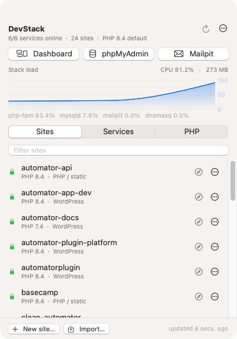

# local-devstack

Native (no Docker, no VM) local WordPress dev stack for macOS on Apple Silicon:
Laravel Valet + Homebrew PHP (8.4 default, 7.4–8.6 available) + `mysql@8.4` + Mailpit + Redis + Memcached + WP-CLI,
one global `devstack` command for everything, and a small menu-bar app (**DevStack**) that drives the same commands.



**Status (2026-09-22):** All 24 hosts on Valet; MAMP PRO stopped and backed out of the system (apps kept for now).
PHP 7.4 and every 8.x (8.0–8.6) are installed, each with redis, imagick, memcached and Xdebug (off) extensions;
php-fpm runs only for versions a site uses (8.4 default, 7.4 for three sites). Redis and Memcached run as brew services.
Phase 5 tooling built: `site-new`, `site-import` (LocalWP exports), `site-remove`, `php-xdebug`, `service`, phpMyAdmin
at `https://phpmyadmin.test` (auto-login as root), and a dashboard at `https://dashboard.test` that shows services,
sites and PHP versions and can start/stop services and toggle Xdebug. Every command is reachable from anywhere as
`devstack <verb>`; `site-backup` (APFS clone + gzip dump, restorable through `site-import`) and the `app/` menu-bar
app (new/import/backup/remove sites, service and Xdebug toggles, live stack load) are built and installed.

Plan and inventory: `docs/mamp-to-valet-migration-handoff-v2.md` (section 0 summary, 6 phases, 10 decisions).
Execution log of the pilot: `docs/superpowers/plans/2026-09-22-phase1-3-pilot.md`.

## Layout (target — see handoff section 11)

```
Brewfile              php 7.4–8.6 (+ redis/imagick/memcached/xdebug per version), mysql@8.4, mailpit, redis, memcached, wp-cli, composer
bootstrap.sh          idempotent; the only thing a teammate must run (`--app` also builds and installs the menu-bar app)
php/                  zz-uo-dev.ini drop-in, copied into each /opt/homebrew/etc/php/<v>/conf.d/
drivers/              LocalValetDriver for the subdirectory multisite (wpmu)
mu-plugins/           uo-local-ssl.php (https_ssl_verify → false, local only)
dashboard/            dashboard.test (PHP + a little JS): services, PHP, logs, tools
bin/                  THE CONTRACT — every command supports --json where output is consumed by tooling
                      devstack (global dispatcher)  site-new  site-import  site-backup  site-remove  php-xdebug
                      service  stack-status  logs  logs-prune  migrate-site  migrate-all  mamp-backout  app
completions/          zsh completion for devstack (linked into $(brew --prefix)/share/zsh/site-functions)
app/                  DevStack.app: SwiftUI MenuBarExtra + Swift Charts, macOS 14+, Swift Package; only ever runs `devstack …`
docs/                 the handoff/plan, execution logs (docs/superpowers/plans), screenshots (docs/img)
```

## Ground rules

- No Docker for WordPress. Homebrew formulae and native binaries only.
- `bootstrap.sh` never depends on `app/`. The app never talks to brew/valet/mysql directly; it calls `bin/*`.
- `uncanny-automator` is a **protected site**: never in a batch, never first, only with a verified fresh backup
  and an explicit flag. See handoff section 6.1.
- `automator-platform` (Docker-only Laravel) is out of scope and must not be served by Valet.
- Scripts are idempotent: re-running on a migrated site is a no-op.

## Quick start

```bash
git clone git@github.com:saad-siddique/local-devstack.git ~/Work/local-devstack
cd ~/Work/local-devstack && ./bootstrap.sh --app  # asks for sudo twice on a fresh Mac (valet install, valet trust);
                                                  # --app also builds DevStack.app into /Applications and starts it
devstack help                                     # from now on, from any directory
devstack migrate cleantest --json                 # one MAMP site: link → isolate → secure → DB copy → DB_HOST → URLs → smoke
devstack migrate-all                              # everything in sites.tsv except protected sites
devstack mamp-backout                             # after MAMP PRO is stopped: hosts entries, helper daemon, shell hooks
```

## The `devstack` command

`bootstrap.sh` links `bin/devstack` to `/opt/homebrew/bin/devstack` (and its zsh completion), so nobody has to
`cd` into the repo. Verbs map to `bin/` scripts; any `bin/` name also works (`devstack site-new …`).

```bash
devstack new myplugin --php 8.2                  # fresh WordPress at https://myplugin.test, prints the admin password once
                                                 # --php accepts 7.4, 8.0, 8.1, 8.2, 8.3, 8.4 (default), 8.5, 8.6
devstack import client ~/Downloads/client.zip    # LocalWP export, any zip/folder with a WordPress root + .sql, or a backup folder
devstack backup myplugin                         # ~/Backups/local-devstack/myplugin/<stamp>/ — see Backups below
devstack backups                                 # list them (newest first)
devstack remove myplugin --yes --backup          # back up, then unlink, unsecure, drop DB + user, delete folder
devstack sites                                   # linked sites with PHP version and protection flag
devstack open myplugin | dashboard | phpmyadmin | mailpit
devstack xdebug on --php 8.4                     # trigger mode, port 9003; use a browser Xdebug helper or XDEBUG_TRIGGER=1
devstack service mailpit restart                 # nginx dnsmasq mysql@8.4 mailpit redis memcached php@<any installed>
devstack status | jq .                           # what the dashboard and the app read
devstack logs list                               # every stack log with size: nginx php php-fpm mysql redis mailpit, wp <site>
devstack logs php -n 100                         # tail one; `devstack logs crashes` lists macOS crash reports for stack processes
devstack logs-prune                              # rotate now (the LaunchAgent does this daily at 04:00)
devstack update                                  # git pull + bootstrap
devstack app install | open | snapshot | status  # the menu-bar app (below)
```

## Backups

`devstack backup <site>` writes `~/Backups/local-devstack/<site>/<YYYYMMDD-HHMMSS>/` holding `files/` (an APFS clone
of the site folder: instant and space-free until either side changes), `db.sql.gz` (`mysqldump --force`, so a stale
view cannot abort it) and `manifest.json` (name, PHP version, database, table count). A 260 MB site backs up in
under three seconds. Restore or clone it with `devstack import <newname> <backup folder>`; the manifest supplies the
PHP version and every old URL is rewritten to the new name. Backups are allowed on protected sites (read-only), and
`devstack remove --backup` refuses to delete anything when the backup fails. Nothing prunes backups for you.

## Menu-bar app (DevStack.app)

A SwiftUI `MenuBarExtra` (macOS 14+) that only ever runs `devstack …` and reads its `--json` output: the app has
no brew, valet or MySQL knowledge of its own, so when a script changes the app does not.

- Panel: stack summary, quick-open buttons (Dashboard, phpMyAdmin, Mailpit with unread count), a three-minute
  CPU/memory chart of the stack's own processes, then Sites (open, wp-admin, folder, back up, remove), Services
  (switches, restart) and PHP (fpm switch, Xdebug checkbox).
- New site, Import, Remove and the live task log open in one ordinary window, so a long import survives the panel
  closing. Remove backs up first by default and is disabled for protected sites.
- Cadence is lean: one `devstack status` per minute while the panel is open, one per five minutes while closed (for
  the icon), CPU samples only while the panel is open. The icon changes when a core service is down or launchd
  reports an error.
- Build and install: `devstack app install` (Swift Package Manager; Xcode *or* the Command Line Tools; ad-hoc
  signed, and locally built apps carry no quarantine flag). `devstack app snapshot` renders every window to
  `docs/img/*.png` without clicking through the menu bar. Once a Developer ID exists:
  `devstack app install --sign "Developer ID Application: …"` (or `DEVSTACK_SIGN_IDENTITY`).
- "Start at login" lives in the ⋯ menu (`SMAppService`).

## Logs and retention

- nginx and PHP errors land in `~/.config/valet/Log/`, the php-fpm master log, Redis and Mailpit in
  `/opt/homebrew/var/log/`, MySQL in `/opt/homebrew/var/mysql/*.err`, each WordPress site in its `wp-content/debug.log`.
- The dashboard is a left-rail app: Overview (service lamps + sites), PHP, Services, Logs, Tools. It reloads once a
  minute while visible, never while hidden, and has a Refresh button; actions refresh immediately. Keeping it lean
  leaves the CPU to the sites.
- The dashboard's **Logs** tab tails any of them with severity colouring, a filter, and a Clear button. The
  masthead turns red when launchd reports a service in error or macOS wrote a crash report for php-fpm, nginx, mysqld,
  redis, memcached, mailpit or dnsmasq in the last 24 hours — the failures WordPress itself cannot report.
- Retention: a user LaunchAgent (`com.local-devstack.logs-prune`) runs `bin/logs-prune` daily at 04:00. Each log is
  copied to `.1` and truncated in place, so writers keep appending; `.1` files older than 48 hours are deleted and any
  live log over 100 MB is rotated immediately. Nothing older than two days survives.

Dashboard writes (start/stop, Xdebug) are POST requests that require the `X-Devstack: 1` header and only ever call the
`bin/` commands above with allow-listed arguments, so another website open in your browser cannot trigger them.

`bootstrap.sh` is idempotent and safe to re-run. After `valet trust` it is fully non-interactive, so agents and
scripts can run it too.

## Things learned the hard way (see handoff section 9 for the rest)

- `brew bundle` un-links keg-only `php@8.4`; the Brewfile pins `link: true` and bootstrap re-links before Valet runs.
- Valet's `valet` wrapper re-execs itself through `sudo`; the sudoers alias from `valet trust` matches
  `/opt/homebrew/bin/valet` only, and in a non-TTY shell the wrapper's own sudo hop still prompts. `valet()` in
  `bin/lib.sh` goes through `sudo -n` directly once trust exists.
- Valet 4.12.0 answers `.test` with `::1` but its nginx stubs only listen on `127.0.0.1`; bootstrap patches the stubs
  and the generated confs (`listen [::1]:…`) so Safari does not 404.
- Mail from Valet sites reaches whatever listens on :1025. While MAMP's MailHog runs, that is MailHog (UI under
  `http://localhost:8025/mailhog/`). After disabling MailHog in MAMP PRO, run `brew services start mailpit` (or
  re-run `bootstrap.sh`); the sites need no change because `sendmail_path` already points at `mailpit sendmail`.
- Right after `valet secure`/`isolate`, nginx and php-fpm restart; a smoke test fired immediately sees 502/503.
  `wait_for_site` in `bin/lib.sh` polls first.
- `WP_HOME`/`WP_SITEURL` constants in wp-config override the database; `migrate-site` rewrites them when they
  point at the MAMP host. `display_errors=On` sends CLI warnings to stdout, so WP-CLI is run with
  `-d display_errors=stderr` whenever its output is captured.
- `wp search-replace` skips `guid` on purpose; a handful of `https://<host>:8890` GUIDs remain and that is fine.
- A stale `VIEW` whose base table is gone makes `mysqldump` abort. The dump runs with `--force`, the import compares
  base tables only and reports missing views; Automator rebuilds its `*_uap_*_logs_view` via
  `wp eval 'Automator_DB::create_views();'`.
- Several sites move wp-login.php (`/login/`, `/frontend-login/`); the login-form smoke check is informational only.
- View `DEFINER`s must exist before `CREATE VIEW` runs on import: `migrate-site` creates the site's DB user first, and
  any extra definer (e.g. the Codeception DB user) must be created by hand beforehand.
- MAMP's vhost serves the *same* folder, so after migration it too reads the new database through the rewritten
  wp-config. Rollback for a site is: restore its wp-config.php from `~/migration-log/*-files-pre.tgz`; MAMP's database
  copy was never touched.
- MAMP PRO rewrites `~/.profile` (PATH + `php`/`mysql`/`python` aliases) every time it runs, even on quit. `bin/mamp-backout`
  strips it and appends a guard to `~/.zshrc` that un-aliases and de-paths anything MAMP re-adds.
- WordPress and WP-CLI look one directory *above* a site for wp-config.php. A stray `~/Sites/wp-config.php` broke
  `wp config create` for every new site; it now lives in `~/migration-log/stray/`. Keep `~/Sites` free of loose WP files.
- Under `set -o pipefail`, `tr … < /dev/urandom | head -c N` kills the script with SIGPIPE. `random_secret` reads a
  fixed chunk first.
- Xdebug from `shivammathur/extensions` ships as `conf.d/20-xdebug.ini`; off = renamed to `.off`. Bootstrap turns it off
  the first time it sees it, then `bin/php-xdebug` owns the state.
- Homebrew's newest PHP is the `php` formula, only *aliased* `php@8.5` (no `opt/php@8.5`, service name `php`). `php_bin`
  in `bin/lib.sh` and `bin/service` map the alias; the Brewfile pins `link: false` so it never steals the `php` symlink.
- Valet 4.12.0 knows PHP versions up to 8.5. Bootstrap appends newer tap builds (8.6) to its `SUPPORTED_PHP_VERSIONS`
  so `valet isolate php@8.6` works; re-applied after every `composer global update`.
- The Redis *cask* cannot be managed by `brew services`; it was replaced by the `redis` formula. A pre-existing
  `redis.conf` had `daemonize yes`, which makes launchd think the service died. Bootstrap does not touch redis.conf;
  keep `daemonize no`. Docker's automator-platform Redis binds `*:6379` while Homebrew's binds `127.0.0.1:6379`; both
  coexist, and `127.0.0.1` reaches Homebrew's.
- "Class not found" fatals after switching plugin branches are a stale Composer classmap: `composer dump-autoload`
  in the plugin repo, not a stack problem.
- The 2026 macOS SDK implements SwiftUI's `@State` as a macro whose plugin ships only with Xcode; the Command Line
  Tools cannot expand it ("plugin for module 'SwiftUIMacros' not found"). `app/` uses tiny `ObservableObject` form
  models instead of `@State` so it builds on either toolchain. `bin/app` prefers Xcode's toolchain when
  `xcodebuild -checkFirstLaunchStatus` passes and falls back to the Command Line Tools otherwise.
- `devstack app snapshot` orders its windows front without activating the app: an early version activated itself and
  swallowed a keystroke meant for another app. Never call `activate(ignoringOtherApps:)` from unattended code.
- A GUI app starts with a bare environment. `bin/devstack` puts `/opt/homebrew/bin` first on `PATH`, and the sudoers
  rules from `valet trust` cover any process of the user, so `valet`/`brew services` work from the app without a TTY.
